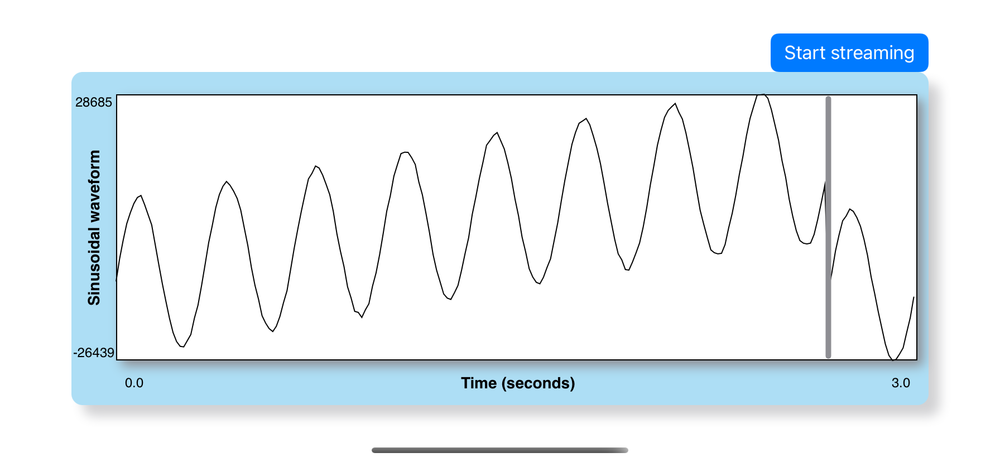
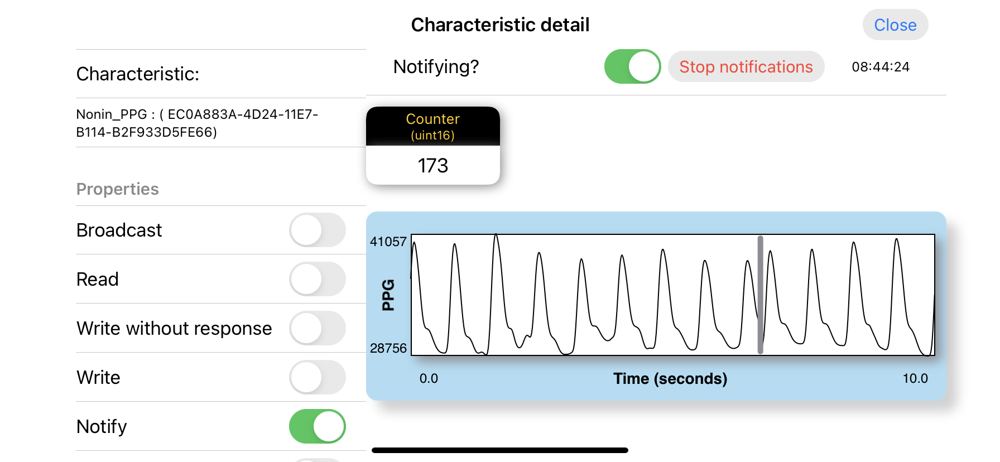

# WaveformPlotter

A library to plot physiological timeseries such as the Photoplethysmogram (PPG)
 recorded from a pulse oximeter

---

WaveformPlotter is free software: you can redistribute it or modify it under 
the terms of the GNU General Public License as published by the Free Software
Foundation, version 2 only. Please check the file [COPYING](COPYING) for more
information on the license and copyright.

If you want to submit pull requests or contribute source code to this 
repository, please read the [CONTRIBUTING.md](CONTRIBUTING.md) for
more information about contributing guidelines.

If you use this app in your projects and publish the results, please cite the
following manuscript:

> Villarroel, M. and Davidson, S. "Open-source software mobile platform for
physiological data acquisition". arXiv (In preparation). 2022

---

WaveformPlotter is an iOS Swift Package written in Swift. The following modules
make use of the functionality provided by WaveformPlotter:

- [swift-waveform_plotter_example](https://github.com/maurovm/swift-waveform_plotter_example): 
Example application to showcase the features available in the "WaveformPlotter"
Swift library.
- [swift-sensor_recording_utils](https://github.com/maurovm/swift-sensor_recording_utils):
A module containing shared utility methods and classes used by other modules 
and applications to record raw data from sensors. 
- [swift-async_bluetooth](https://github.com/maurovm/swift-async_bluetooth): 
A Swift Package that replicates some of the functionality provided by Apple's 
CoreBluetooth module, but using Swift's latest async/await concurrency features.
- [swift-async_pulse_ox](https://github.com/maurovm/swift-async_pulse_ox): 
The main module that has all the functionality to connect and record data from
devices that support Bluetooth Low Energy (BLE) protocol, such as heart rate 
monitors and pulse oximeters. 

Examples of other applications making use of the above Swift Packages are:

- [swift-thermal_recorder](https://github.com/maurovm/swift-thermal_recorder): 
Record video from thermal cameras such as the FLIR One.
- [swift-pulse_ox_recorder](https://github.com/maurovm/swift-pulse_ox_recorder): 
The main application (XCode, Settings.bundle, etc) to record time-series data 
from devices that support Bluetooth Low Energy (BLE) protocol.

## Plotting Examples

The image below shows an example of plotting a sinusoidal waveform using the
synthetic data generator in this moulde and running the
[swift-waveform_plotter_example](https://github.com/maurovm/swift-waveform_plotter_example)
sample application:

    <kbd>
    
    </kbd>

The image below is an example of the plotting the Photoplethysmogram (PPG)
signal recorded from a pulse oximeter from the
[swift-pulse_ox_recorder](https://github.com/maurovm/swift-pulse_ox_recorder)
application:

    <kbd>
    
    </kbd>

